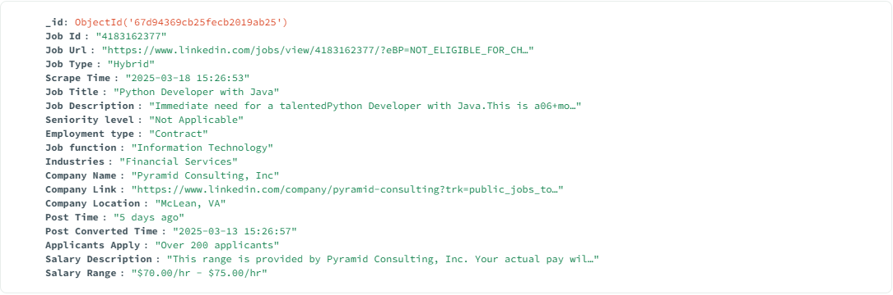

# LinkedIn Job Scraper

## Overview
This project is a LinkedIn job scraper that extracts job details, company information, and employee data. It uses Selenium for automation and MongoDB for data storage.

## Features
- Scrapes job listings from LinkedIn
- Extracts company and employee details
- Stores data in MongoDB
- Multi-threaded for efficient scraping

## Requirements
- Docker
- Python 3.8+
- Google Chrome & ChromeDriver
- MongoDB (running on localhost:27017)

## Installation

### Clone the Repository
```sh
git clone https://github.com/bhavin3206/linkedin-scraper.git
cd linkedin-scraper
```

### Install Dependencies
```sh
pip install -r requirements.txt
```

## Usage

### Run Locally
```sh
python main.py
```

### Run with Docker
#### 1. Build Docker Image
```sh
docker build -t bhavin3206/linkedin-scraper .
```

#### 2. Run Docker Container
```sh
docker run -it --rm bhavin3206/linkedin-scraper
```

## Pulling the Docker Image
To pull the image from Docker Hub:
```sh
docker pull bhavin3206/linkedin-scraper
```

## Configuration
Edit `config.json` to modify scraping parameters:
```json
{
  "num_drivers": 5,
  "headless": true,
  "mongo_uri": "mongodb://localhost:27017",
  "database_name": "local"
}
```
## scraped data example 



## License
This project is licensed under the MIT License.

